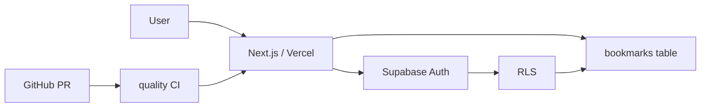

# Bookmarks Web App

`nextjs-supabase-vercel-webapp-template` の **Use this template** から作成した第三者利用テスト用Webアプリです。

元テンプレートに含まれていたTodoは**削除可能なサンプル**として扱い、本Repositoryでは削除済みです。共通基盤の Next.js / Supabase Auth / PWA / CI / Vercel 対応は維持し、独自のBookmarks機能へ置き換えています。



## 機能

- メール認証 / セッションCookie
- Bookmarkの追加・一覧・更新・削除
- `user_id` 単位のRow Level Security
- 匿名ユーザーへのtable権限なし
- PWA / Offline fallback
- `/bookmarks` はService Workerのキャッシュ対象外
- GitHub Actions `quality` CI
- Vercel Deploy

## 独自feature

```text
app/(app)/bookmarks/page.tsx
features/bookmarks/actions.ts
supabase/migrations/20260904144500_create_bookmarks.sql
tests/bookmarks.test.mjs
```

元テンプレートのTodoサンプルは次を削除しています。

```text
app/(sample)/dashboard/
features/todos/
supabase/sample/todos.sql
tests/sample.test.mjs
```

## ローカル確認

Node.js 22以上を使用します。

```powershell
npm run doctor
npm ci
npm run check
```

Supabase接続時は `.env.example` を `.env.local` へコピーし、次を設定します。

```text
NEXT_PUBLIC_SUPABASE_URL
NEXT_PUBLIC_SUPABASE_PUBLISHABLE_KEY
NEXT_PUBLIC_SITE_URL
```

DBには次のMigrationを適用します。

```text
supabase/migrations/20260904144500_create_bookmarks.sql
```

## GitHub運用

このRepositoryでは次の流れを使用します。

```text
日本語Issue
  ↓
Issue番号入りBranch
  ↓
Pull Request
  ↓
quality CI
  ↓
Squash Merge
```

新しくテンプレートからRepositoryを作った場合、Rulesetは自動継承されないため、対象Repository自身の `scripts/setup-github.ps1` を実行します。ChatGPT / CodexのGitHub連携を「Only select repositories」で使う場合は、新Repositoryもアクセス対象へ追加します。

## 資料

初めてGit / GitHubを使う場合は [BEGINNER-GUIDE.md](BEGINNER-GUIDE.md) から始めてください。

- 初期セットアップ: [GETTING-STARTED.md](GETTING-STARTED.md)
- GitHub安全設定: [docs/GITHUB-SETUP.md](docs/GITHUB-SETUP.md)
- Supabase設定: [docs/SUPABASE-SETUP.md](docs/SUPABASE-SETUP.md)
- 元テンプレートのカスタマイズ境界: [docs/CUSTOMIZING.md](docs/CUSTOMIZING.md)
- 独自feature追加: [docs/EXTENDING.md](docs/EXTENDING.md)
- 運用・障害対応: [docs/OPERATIONS.md](docs/OPERATIONS.md)
- 第三者利用スモークテスト: [docs/TEMPLATE-SMOKE-TEST.md](docs/TEMPLATE-SMOKE-TEST.md)
- 開発ルール: [docs/DEVELOPMENT.md](docs/DEVELOPMENT.md)
- デプロイ: [docs/DEPLOYMENT.md](docs/DEPLOYMENT.md)

## テスト目的

このRepositoryは業務アプリそのものではなく、第三者がテンプレートから新しいアプリを作る流れを実際に検証するためのRepositoryです。検証記録は `THIRD-PARTY-TEST.md` に残します。

## License

元テンプレートと同じ **MIT License** です。
